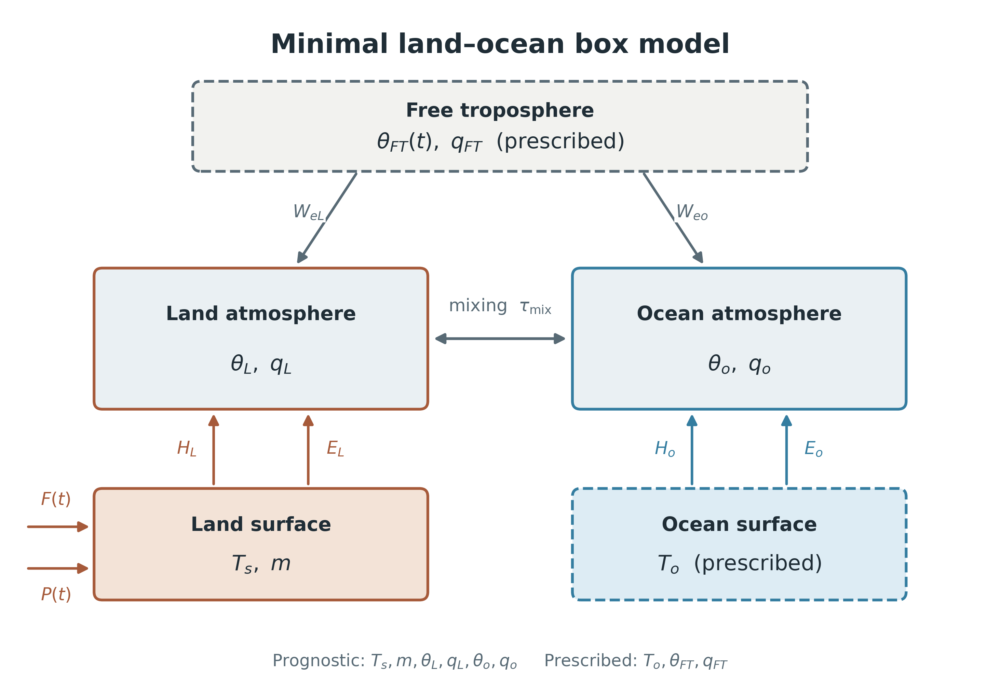

# ACDC Coastal Temperatures

This repository develops minimal stochastic box models for land--ocean controls on coastal air temperature. The current model specification couples land surface temperature and soil moisture to land and ocean atmospheric heat and moisture reservoirs.



## Development status

- `original_soil_model.py` is the legacy land-only baseline. It predicts land surface temperature plus surface- and root-zone soil moisture, while atmospheric temperature and humidity are prescribed forcings.
- The six-state land--ocean system documented below is the updated model specification. An executable implementation of this system has not yet been added to this branch.

This distinction is important: the schematic and equations describe the intended coupled model, not results produced by the current baseline script.

## Updated land--ocean model

### State vector and prescribed boundary conditions

The prognostic state is

$$
\mathbf{x}=(T_s,m,\theta_L,q_L,\theta_o,q_o),
$$

where $T_s$ is land surface temperature, $m\in[0,1]$ is normalized soil moisture, and $(\theta_L,q_L)$ and $(\theta_o,q_o)$ are the land and ocean atmospheric temperature--humidity pairs. Ocean surface temperature is fixed:

$$
\frac{dT_o}{dt}=0, \qquad T_o=\text{constant}.
$$

Near-surface air temperatures are approximated by the corresponding atmospheric box temperatures, $T_{a,L}\simeq\theta_L$ and $T_{a,o}\simeq\theta_o$.

### Land surface and soil moisture

The land surface energy budget is

$$
C_L\frac{dT_s}{dt}
=F(t)-\sigma T_s^4+\epsilon_a\sigma\theta_L^4-L_vE_L-H_L,
$$

and normalized soil moisture evolves as

$$
\frac{dm}{dt}=\frac{P-E_L}{W_{\max}},
\qquad
W_{\max}=\rho_l h_s\phi,
\qquad 0\le m\le1.
$$

Here $F(t)$ is the seasonal surface forcing, $P$ is stochastic precipitation, $E_L$ is land evaporation, and $H_L$ is the land sensible heat flux.

### Land and ocean atmospheric boxes

Land atmospheric temperature and humidity satisfy

$$
\frac{d\theta_L}{dt}
=\frac{\theta_o-\theta_L}{\tau_{\rm mix}}
+\frac{H_L}{C_A}
+W_{eL}(\theta_{FT}-\theta_L),
$$

$$
\frac{dq_L}{dt}
=\frac{q_o-q_L}{\tau_{\rm mix}}
+\frac{E_L}{M_A}
+W_{eL}(q_{FT}-q_L),
$$

while the ocean atmospheric box satisfies

$$
\frac{d\theta_o}{dt}
=\frac{\theta_L-\theta_o}{\tau_{\rm mix}}
+\frac{H_o}{C_A}
+W_{eo}(\theta_{FT}-\theta_o),
$$

$$
\frac{dq_o}{dt}
=\frac{q_L-q_o}{\tau_{\rm mix}}
+\frac{E_o}{M_A}
+W_{eo}(q_{FT}-q_o).
$$

The atmospheric heat and mass capacities are $C_A=\rho_a c_p h_A$ and $M_A=\rho_a h_A$. The exchange timescale $\tau_{\rm mix}$ couples the two atmospheric boxes. The coefficients $W_{eL}$ and $W_{eo}$ represent entrainment from a prescribed free troposphere $(\theta_{FT},q_{FT})$.

### Surface flux closure

With $[x]_+=\max(x,0)$, the evaporative mass-flux closures are

$$
E_L=\frac{\rho_a}{r_{LS}}m\,[q_s^*(T_s)-q_L]_+,
\qquad
E_o=\frac{\rho_a}{r_{LO}}[q_s^*(T_o)-q_o]_+,
$$

and the sensible heat fluxes are

$$
H_L=\frac{\rho_a c_p}{r_{SS}}(T_s-\theta_L),
\qquad
H_o=\frac{\rho_a c_p}{r_{SO}}(T_o-\theta_o).
$$

The subscripts $LS$ and $SS$ denote land latent and sensible resistances; $LO$ and $SO$ denote their ocean counterparts. During integration, saturation specific humidity is linearized about a reference state:

$$
q_s^*(T)\simeq q^*_{\rm ref}+\gamma_q(T-T_{\rm ref}),
\qquad
\gamma_q\simeq\frac{q^*_{\rm ref}L_v}{R_vT_{\rm ref}^2}.
$$

### Seasonal forcing and stochastic precipitation

The seasonal forcing is

$$
F(t)=F_0-F_1\cos\!\left(\frac{2\pi t}{T_{\rm yr}}\right),
$$

$$
\theta_{FT}(t)=\theta_{FT,0}-\theta_{FT,1}
\cos\!\left(\frac{2\pi t}{T_{\rm yr}}-\varphi_T\right),
$$

with constant $q_{FT}$. Suggested inherited values are $F_0=160\ \mathrm{W\,m^{-2}}$, $F_1=80\ \mathrm{W\,m^{-2}}$, $\theta_{FT,0}=290\ \mathrm{K}$, and $\theta_{FT,1}=4\ \mathrm{K}$.

Rain events are sampled as a Poisson process with rate $\lambda_P=0.2\ \mathrm{day^{-1}}$. For an event, rainfall depth follows

$$
D\sim\mathrm{Gamma}(k_P,\theta_P),
\qquad k_P=8,
\qquad \theta_P=1\ \mathrm{mm},
$$

so the mean event depth is $8\ \mathrm{mm}$.

## Repository contents

- `original_soil_model.py`: legacy land-only numerical model.
- `make_land_ocean_box_schematic.py`: Python source for the model schematic.
- `figures/land_ocean_box_model_schematic.png`: README-ready raster figure.
- `figures/land_ocean_box_model_schematic.svg`: editable vector figure.
- `figures/land_ocean_box_model_schematic.pdf`: publication-ready vector figure.

Regenerate the schematic with:

```bash
python3 make_land_ocean_box_schematic.py
```

This command requires Python 3 and Matplotlib.
