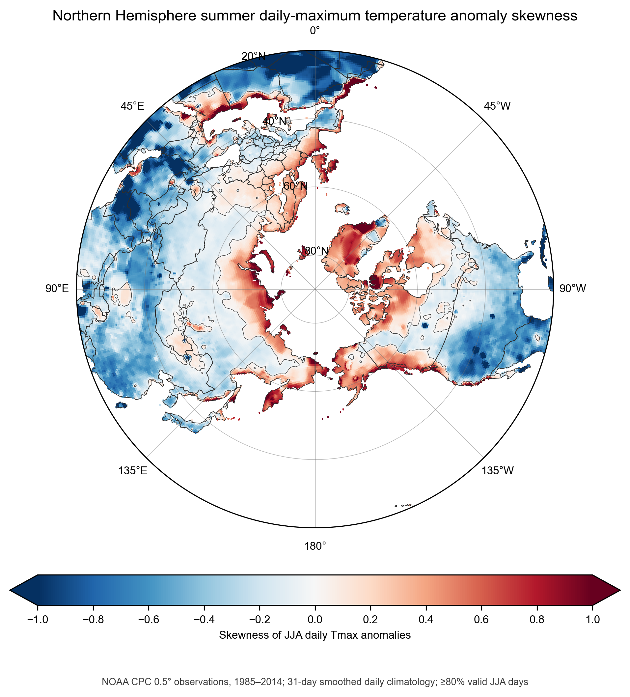
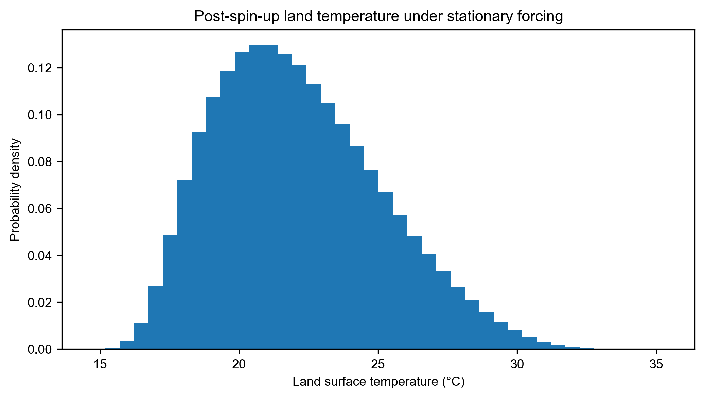
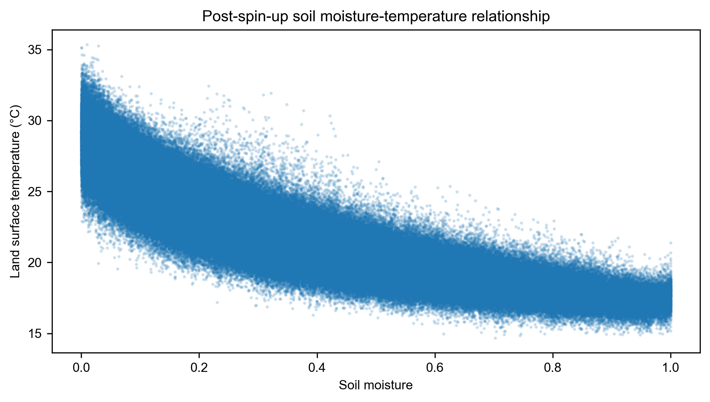
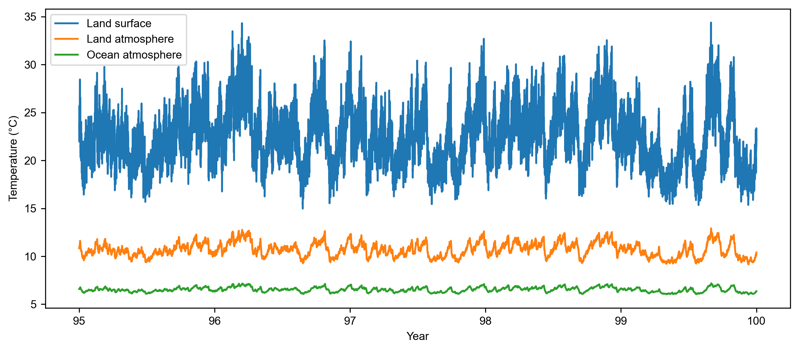

# ACDC Coastal Temperatures

## Project links

- [Shared Google Drive folder](https://drive.google.com/drive/folders/16f1sFb1bPPwaMmKPY4DJ5QeR5aFLqNeF?usp=sharing)
- [Editable Overleaf manuscript](https://www.overleaf.com/9982126531gkfzgctpmhdv#af9c42)

This repository develops minimal stochastic box models for land--ocean controls on coastal air temperature. The current model specification couples land surface temperature and soil moisture to land and ocean atmospheric heat and moisture reservoirs.

The current model implementation, scripts, and figures are organized in [`climatekid/`](climatekid/).


## Development status

- `climatekid/original_soil_model.py` is the legacy land-only baseline. It predicts land surface temperature plus surface- and root-zone soil moisture, while atmospheric temperature and humidity are prescribed forcings.
- `climatekid/land_ocean_box_model.py` is the executable implementation of the updated six-state land--ocean specification documented below.

The current land--ocean experiment is a numerical model baseline. Its output has not yet been validated against observations and should not be interpreted as proof of a coastal-temperature mechanism.

## Observed Northern Hemisphere temperature skewness

The observational target is documented using NOAA CPC Global Unified daily maximum temperature on a 0.5° grid north of 20°N for 1985--2014.

<p align="center">
  
</p>

At each grid cell, the daily climatology is smoothed with a centered 31-day running mean and removed from JJA daily maximum temperature. Skewness is then calculated from all valid JJA anomalies as

```math
\gamma_1 = \frac{\left\langle (T^{\prime}-\overline{T^{\prime}})^3 \right\rangle}{\left\langle (T^{\prime}-\overline{T^{\prime}})^2 \right\rangle^{3/2}}.
```

Grid cells with fewer than 80% of the expected JJA days are masked. Positive values indicate a heavier warm-anomaly tail, whereas negative values indicate a heavier cold-anomaly tail.

## Updated land--ocean model

### State vector and prescribed boundary conditions

The prognostic state is

$$
\mathbf{x}=(T_s,m,\theta_L,q_L,\theta_o,q_o),
$$

where $T_s$ is land surface temperature, $m\in[0,1]$ is normalized soil moisture, and $(\theta_L,q_L)$ and $(\theta_o,q_o)$ are the land and ocean atmospheric temperature--humidity pairs. Ocean surface temperature is fixed:

$$
\frac{dT_o}{dt}=0, \qquad T_o=270\ \mathrm{K}.
$$

Near-surface air temperatures are approximated by the corresponding atmospheric box temperatures, $T_{a,L}\simeq\theta_L$ and $T_{a,o}\simeq\theta_o$.

### Land surface and soil moisture

The land surface energy budget is

$$
C_L\frac{dT_s}{dt}
=F(t)-\epsilon_s\sigma T_s^4
+\epsilon_s\epsilon_A\sigma\theta_L^4-L_vE_L-H_L,
$$

where the land heat capacity varies with normalized soil moisture:

$$
C_L=h_s\left(c_{p,s}\rho_s+c_{p,l}\rho_l\phi m\right).
$$

Normalized soil moisture evolves as

$$
\frac{dm}{dt}=\frac{P-E_L}{W_{\max}},
\qquad
W_{\max}=\rho_l h_s\phi,
\qquad 0\le m\le1.
$$

Here $F(t)$ is stationary stochastic surface radiative forcing, $P$ is stochastic precipitation, $E_L$ is land evaporation, and $H_L$ is the land sensible heat flux.

### Land and ocean atmospheric boxes

Land atmospheric temperature and humidity satisfy

$$
\frac{d\theta_L}{dt}
=\frac{\theta_o-\theta_L}{\tau_{\rm mix}}
+\frac{H_L}{C_A}
+\frac{R_L}{C_A}
+W_{eL}(\theta_{FT}-\theta_L),
$$

$$
\frac{dq_L}{dt}
=\frac{q_o-q_L}{\tau_{\rm mix}}
+\frac{E_L}{M_A}
+W_{eL}(q_{FT}-q_L),
$$

while the ocean atmospheric box satisfies

$$
\frac{d\theta_o}{dt}
=\frac{\theta_L-\theta_o}{\tau_{\rm mix}}
+\frac{H_o}{C_A}
+\frac{R_o}{C_A}
+W_{eo}(\theta_{FT}-\theta_o),
$$

$$
\frac{dq_o}{dt}
=\frac{q_L-q_o}{\tau_{\rm mix}}
+\frac{E_o}{M_A}
+W_{eo}(q_{FT}-q_o).
$$

The atmospheric heat and mass capacities are $C_A=\rho_a c_p h_A$ and $M_A=\rho_a h_A$. The exchange timescale $\tau_{\rm mix}=2$ days couples the two atmospheric boxes. The implemented entrainment coefficients are $W_{eL}=W_{eo}=5\times10^{-6}\ \mathrm{s^{-1}}$, equivalent to an e-folding timescale of approximately $2.315$ days. The terms $R_L$ and $R_o$ are the net longwave heating rates of the land and ocean atmospheric boxes.

### Longwave radiation closure

The current experiment uses surface, atmospheric-box, and free-tropospheric effective emissivities

$$
\epsilon_s=1.00,
\qquad
\epsilon_A=0.67,
\qquad
\epsilon_{FT}=0.67.
$$

Upward longwave emission from the land and prescribed ocean surfaces is

$$
OLR_L=\epsilon_s\sigma T_s^4,
\qquad
OLR_o=\epsilon_s\sigma T_o^4,
$$

and the land surface absorbs downward emission from the land atmospheric box according to

$$
DLR_L=\epsilon_s\epsilon_A\sigma\theta_L^4.
$$

The prescribed free-tropospheric downward longwave forcing is

$$
R_{ad}=\epsilon_{FT}\sigma\theta_{FT}^4.
$$

The net longwave heating of each atmospheric box includes absorption of free-tropospheric and surface radiation and two-sided atmospheric emission:

$$
R_L=\epsilon_A(R_{ad}+OLR_L)
-2\epsilon_A\sigma\theta_L^4,
$$

$$
R_o=\epsilon_A(R_{ad}+OLR_o)
-2\epsilon_A\sigma\theta_o^4.
$$

The $\theta$ variables are used as effective radiating temperatures in this minimal closure. The implemented parameterization does not include a separate transmitted free-tropospheric longwave term in the land surface budget.

### Surface flux closure

With $\left[x\right]_{+}=\max(x,0)$, the evaporative mass-flux closures are

```math
E_L = \frac{\rho_a}{r_{LS}}\,m\left[q_s^{\ast}(T_s)-q_L\right]_+,\qquad E_o = \frac{\rho_a}{r_{LO}}\left[q_s^{\ast}(T_o)-q_o\right]_+.
```

and the sensible heat fluxes are

$$
H_{L}=\frac{\rho_{a}c_{p}}{r_{SS}}(T_{s}-\theta_{L}),
\qquad
H_{o}=\frac{\rho_{a}c_{p}}{r_{SO}}(T_{o}-\theta_{o}).
$$

The subscripts $LS$ and $SS$ denote land latent and sensible resistances; $LO$ and $SO$ denote their ocean counterparts. Saturation specific humidity is evaluated nonlinearly at the land and ocean surface temperatures using

```math
T_C=T-273.15,\qquad
e_s(T)=6.11\times10^{\frac{7.5T_C}{237.5+T_C}},\qquad
q_s^{\ast}(T)=\frac{0.622e_s(T)}{p_s-0.37e_s(T)},
```

where $e_s$ and $p_s$ are expressed in hPa.

### Stationary radiative forcing and stochastic precipitation

The updated experiment has no annual cycle. Surface radiative forcing is a stationary, nonnegative AR(1) process,

$$
F_n=\max(F_0+F_n^{\prime},0),
$$

$$
F_{n+1}^{\prime}=\rho_FF_n^{\prime}+\eta_n,
\qquad
\rho_F=\exp\!\left(-\frac{\Delta t}{\tau_F}\right),
$$

where $\eta_n$ is Gaussian with variance $\sigma_F^2(1-\rho_F^2)$. The parameters are $F_0=240\ \mathrm{W\,m^{-2}}$, $\sigma_F=30\ \mathrm{W\,m^{-2}}$, $\tau_F=0.001$ day, and random seed 1. With $\Delta t=0.05$ day, $\rho_F=\exp(-50)\simeq1.93\times10^{-22}$, so successive forcing anomalies are effectively independent at the model timestep. Free-tropospheric conditions are constant: $\theta_{FT}=290\ \mathrm{K}$ and $q_{FT}=0.003$.

Rain events are sampled as a Poisson process with rate $\lambda_P=0.2\ \mathrm{day^{-1}}$. For an event, rainfall depth follows

$$
D\sim\mathrm{Gamma}(k_P,\theta_P),
\qquad k_P=8,
\qquad \theta_P=1\ \mathrm{mm},
$$

so the mean event depth is $8\ \mathrm{mm}$.

## Reference numerical experiment

The committed reference experiment integrates 100 years with 20 timesteps per day ($\Delta t=1.2$ hours), removes the first 10 years as spin-up, fixes $T_o=270\ \mathrm{K}$, uses $\tau_{\rm mix}=2$ days, and applies $W_{eL}=W_{eo}=5\times10^{-6}\ \mathrm{s^{-1}}$. Radiative forcing uses seed 1 and precipitation uses seed 42. The full 90-year post-spin-up sample contains 657,000 timesteps and gives

- mean land surface temperature: $295.276\ \mathrm{K}$;
- standard deviation: $2.986\ \mathrm{K}$;
- population skewness: $0.482$.

Because the forcing has no annual cycle, the analysis uses every post-spin-up timestep rather than a nominal JJA window. These values and figures are deterministic outputs of one fixed-seed realization of the current model and parameter set, not observational validation.

### Post-spin-up land-temperature distribution



### Post-spin-up soil moisture--temperature relationship



### Last five simulated years



## Repository contents

- `climatekid/original_soil_model.py`: legacy land-only numerical model.
- `climatekid/land_ocean_box_model.py`: updated executable six-state land--ocean model and result-figure generator.
- `climatekid/make_land_ocean_box_schematic.py`: Python source for the model schematic.
- `climatekid/cpc_northern_hemisphere_summer_skewness.py`: CPC download, anomaly, skewness, and polar-map workflow.
- `climatekid/figures/cpc_northern_hemisphere_jja_tmax_anomaly_skewness_1985_2014.png`: observed Northern Hemisphere JJA anomaly-skewness map.
- `climatekid/figures/land_ocean_box_model_schematic.png`: model schematic.
- `climatekid/figures/land_ocean_postspinup_temperature_distribution.png`: full post-spin-up land-temperature distribution.
- `climatekid/figures/land_ocean_postspinup_soil_moisture_temperature.png`: full post-spin-up soil moisture--temperature relationship.
- `climatekid/figures/land_ocean_last_five_year_temperature_timeseries.png`: final five-year temperature evolution.

Run the numerical experiment and regenerate its three figures with:

```bash
cd climatekid
python3 land_ocean_box_model.py
```

Regenerate the schematic with:

```bash
cd climatekid
python3 make_land_ocean_box_schematic.py
```

The scripts require Python 3, NumPy, and Matplotlib.
